# Lab 2 - Footprinting

For this lab, the scenario is I have been contracted by Starbucks for a reconnaissance and footprinting project. I did the following operations and reported back the findings for a larger report.

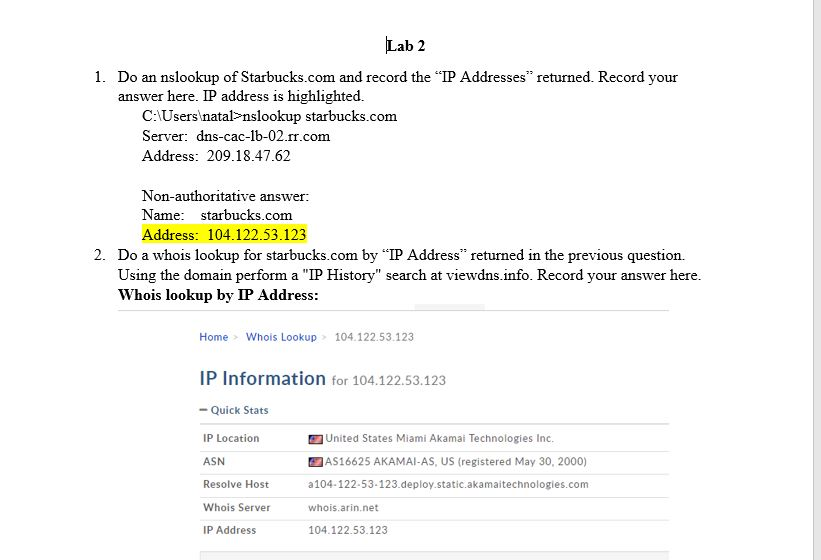
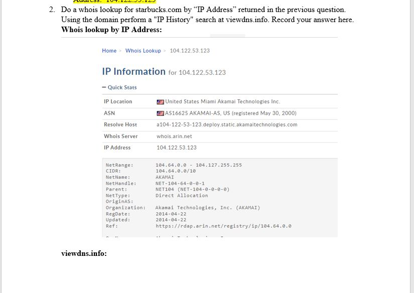
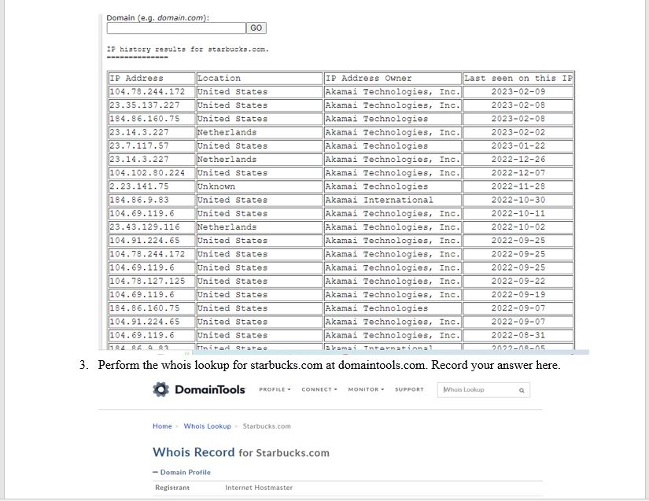
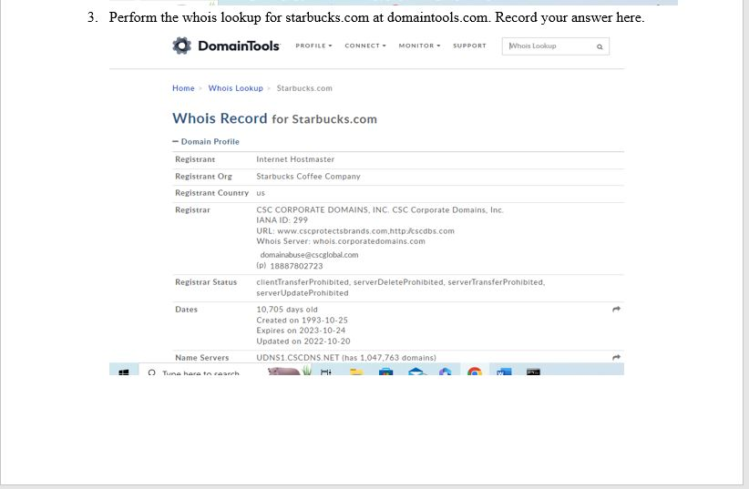
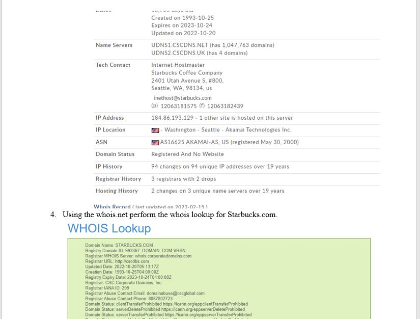
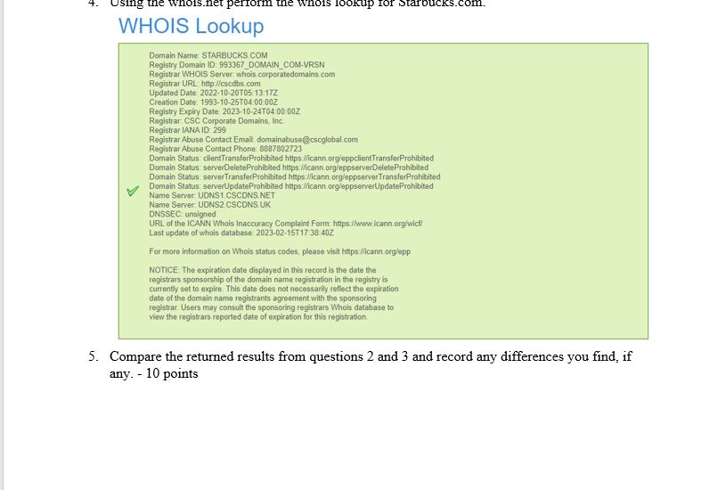
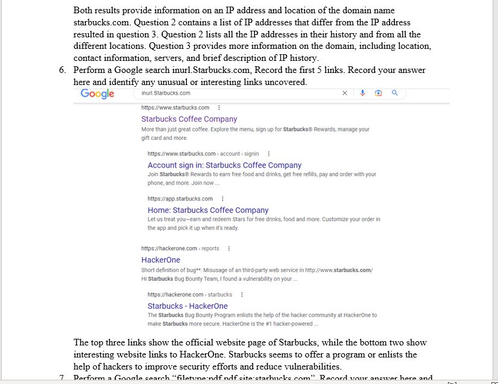
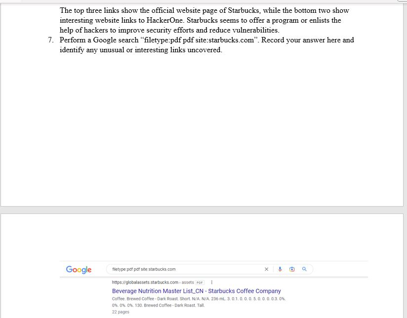
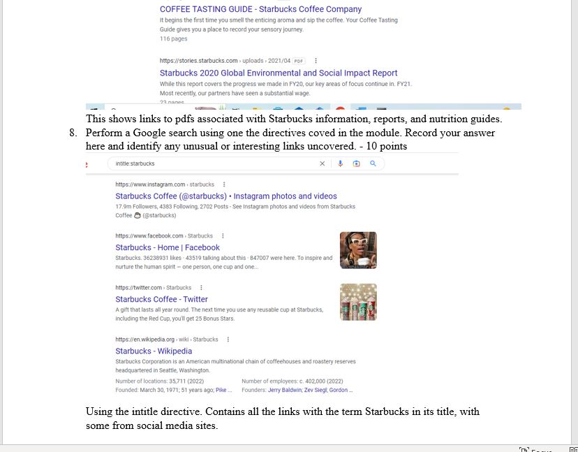
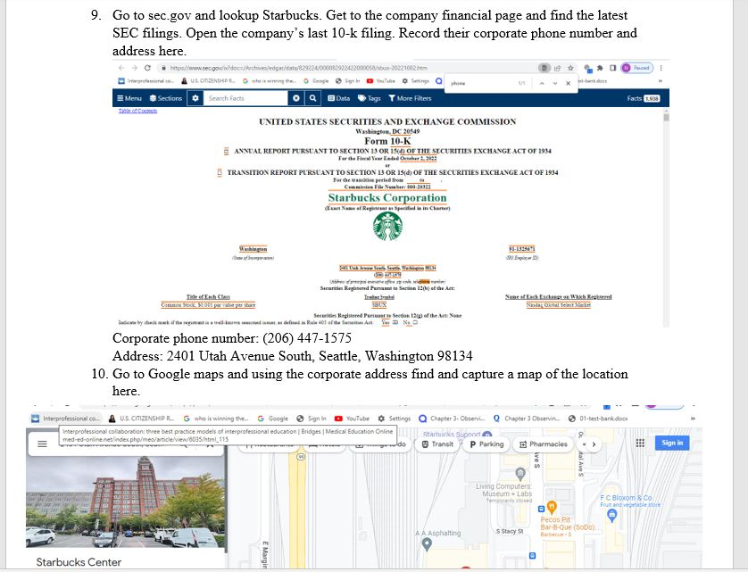
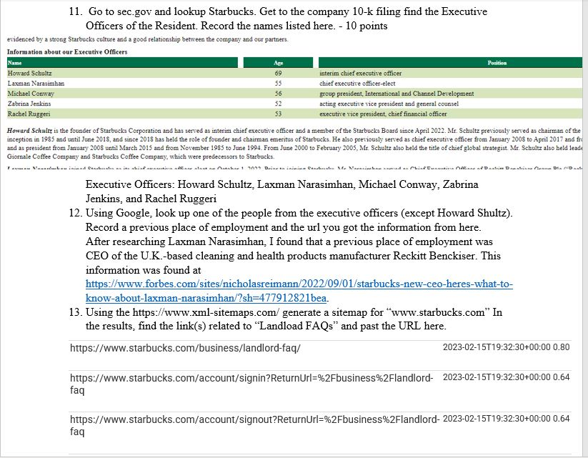
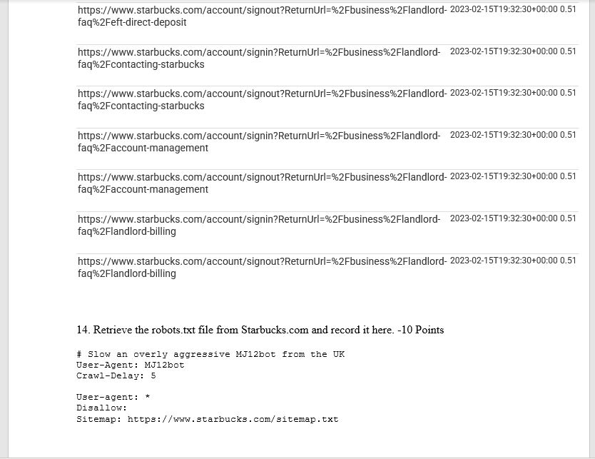

