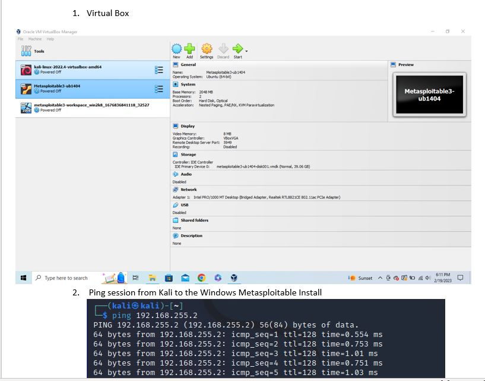
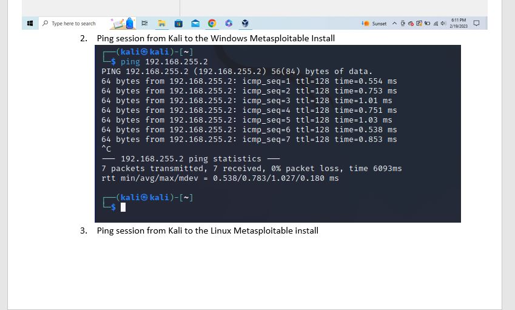

# Lab 3 - Test Lab Setup

For this lab, I set up a lab environment by installing virtualization software, which allows me to run multiple systems on one machine. I used VirtualBox as the virual machine manager. I then set up Kali Linux, which is a virutal machine that contains several attack tools. It will be used as the attack machine in the lab. Then, I set up vulnerable hosts by installing Vagrant and configuring the vulnerable Windows host. Lastly, I set up the vulnerable Linux host.

